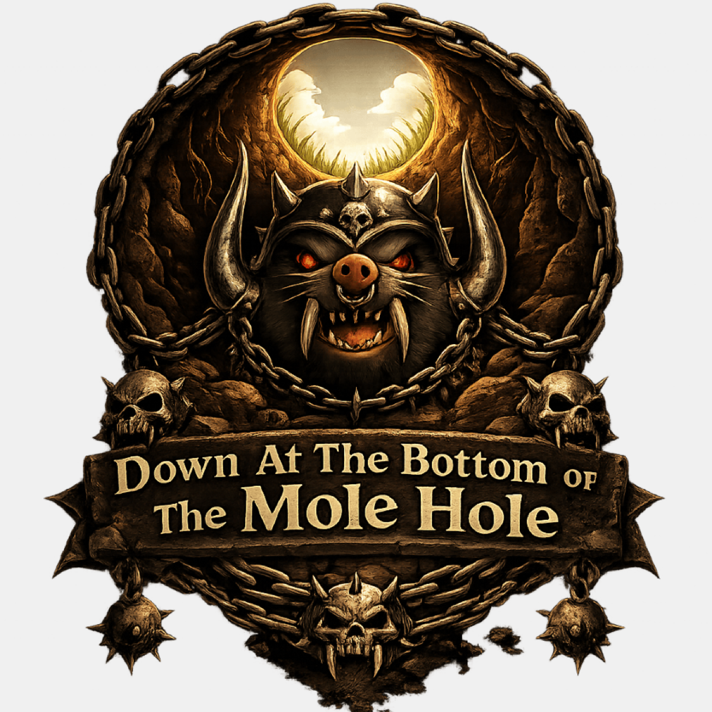

# yarn-ado




Run modern Yarn and Yarn Classic workflows in Azure DevOps pipelines.

This extension is maintained as an independent hard fork of the original Geek Learning task set. The goal of the fork is to keep Yarn relevant in current Azure DevOps environments for both Yarn Classic and Yarn 2+ and later.

## Included Tasks

- **YarnInstaller**: installs the latest stable modern Yarn through Corepack by default, or Yarn Classic on request
- **Yarn**: runs Yarn commands and supports authenticated registries

## Quick Start

```yaml
steps:
  - task: YarnInstaller@1
    displayName: Use latest stable Yarn
    inputs:
      versionSpec: stable

  - task: Yarn@1
    displayName: Install dependencies
    inputs:
      arguments: install --frozen-lockfile
```

By default, `YarnInstaller@1` enables Corepack and activates the latest stable Yarn release for you. Request `1.x` explicitly if you need Yarn Classic, or specify a concrete modern version such as `4.x` when you want to pin it.

The intended approach for Yarn 2+ and later is to let `YarnInstaller@1` prepare the requested version, then use `Yarn@1` as the pipeline execution wrapper.

## Visual Configuration


## Resources

- [Repository](https://github.com/DownAtTheBottomOfTheMoleHole/yarn-ado)
- [Issues](https://github.com/DownAtTheBottomOfTheMoleHole/yarn-ado/issues)
- [Releases](https://github.com/DownAtTheBottomOfTheMoleHole/yarn-ado/releases)
- [Security Policy](https://github.com/DownAtTheBottomOfTheMoleHole/yarn-ado/blob/main/SECURITY.md)
